# Data Processing with Dataproc Serverless

## Enable APIs (Don't show to students)

- Dataproc API

  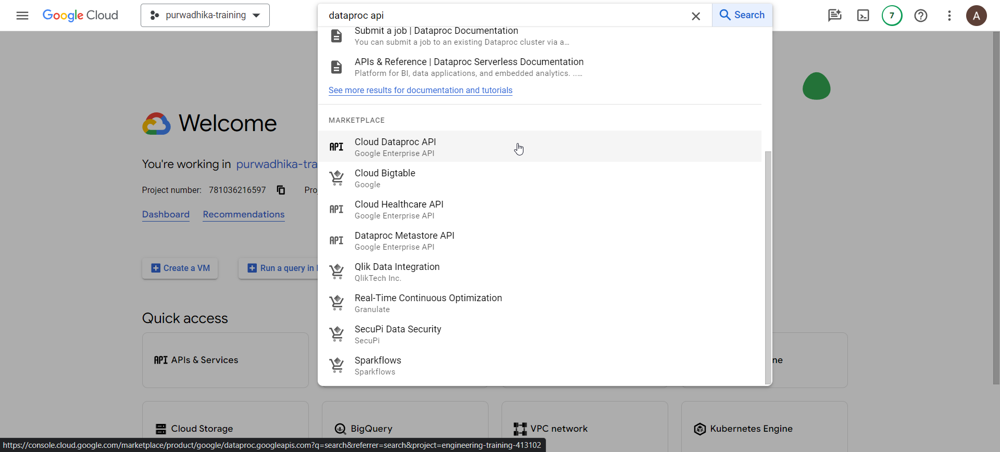

- Click on `ENABLE`

## Configure network connectivity (Don't show to students)

- Go to VPC Networks

  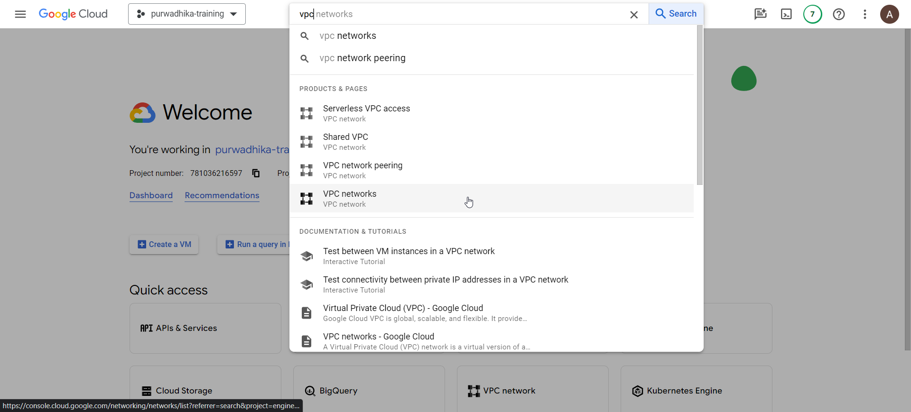

- Click on `default` network

  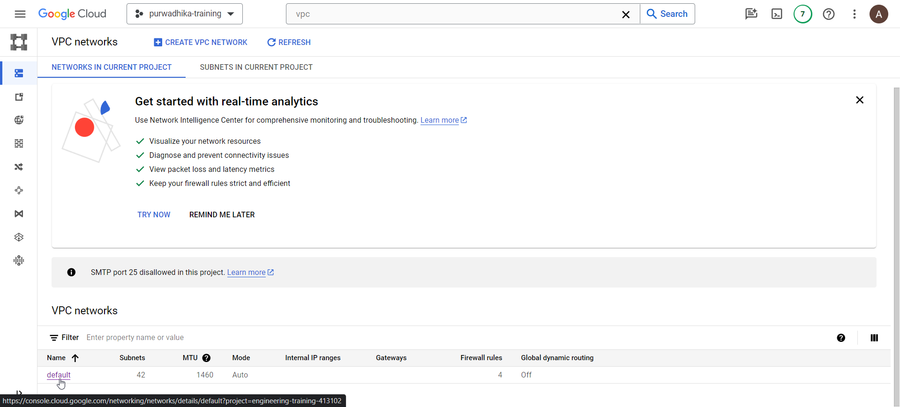

- On the `default` network details, click on `SUBNETS` tab

  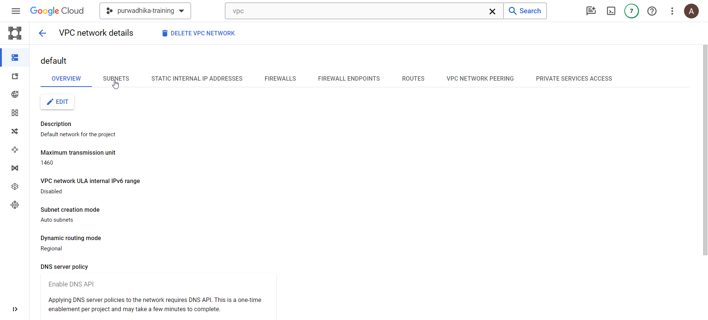

- Look for subnet in the region `asia-southeast2` or other region you want to use for dataproc serverless

  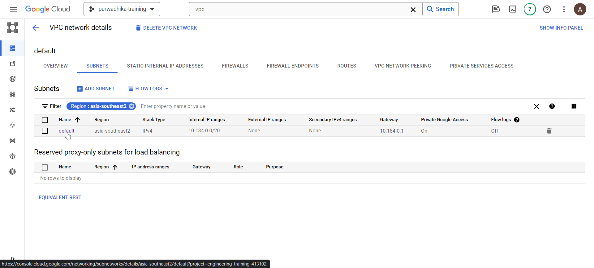

- Click on the `default` subnet and click on `EDIT`

  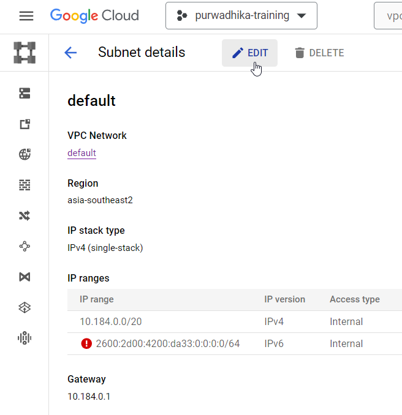

- Enable private google access

  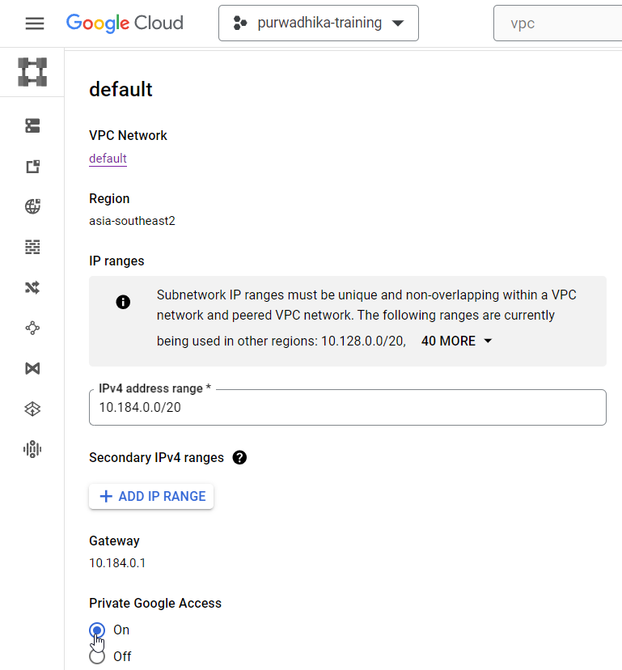

- Save the changes

## Prepare prerequisites

- Make sure git, github cli (gh) and wget is available on your cloud shell

  ```bash
  # check git
  git --version

  # check github CLI
  gh --version

  # check wget
  wget --version
  ```

- If any of the above are not installed, install them with the following

  ```bash
  # install git
  sudo apt-get install git

  # install wget
  sudo apt-get install wget

  # install github cli
  type -p curl >/dev/null || (sudo apt-get update && sudo apt-get install curl -y)
  curl -fsSL https://cli.github.com/packages/githubcli-archive-keyring.gpg | sudo dd of=/usr/share/keyrings/githubcli-archive-keyring.gpg \
  && sudo chmod go+r /usr/share/keyrings/githubcli-archive-keyring.gpg \
  && echo "deb [arch=$(dpkg --print-architecture) signed-by=/usr/share/keyrings/githubcli-archive-keyring.gpg] https://cli.github.com/packages stable main" | sudo tee /etc/apt/sources.list.d/github-cli.list > /dev/null \
  && sudo apt-get update \
  && sudo apt-get install gh -y
  ```

- Authenticate with Github CLI:

  ```bash
  gh auth login
  ```

- You will be getting some prompts

  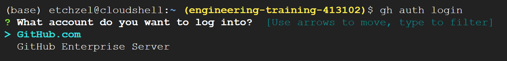

  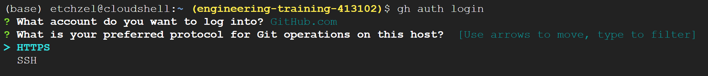

  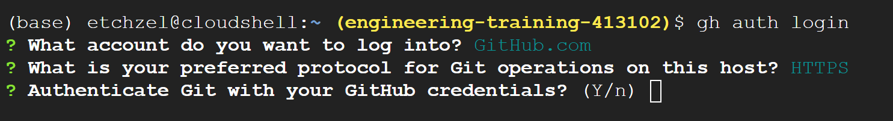

  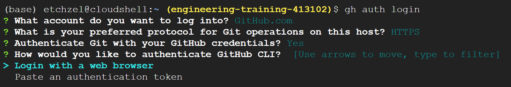

  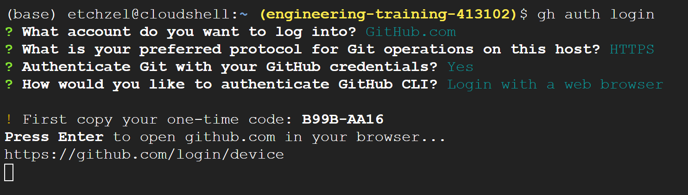

- Open the URL from the prompt on your browser and enter the OTP code

  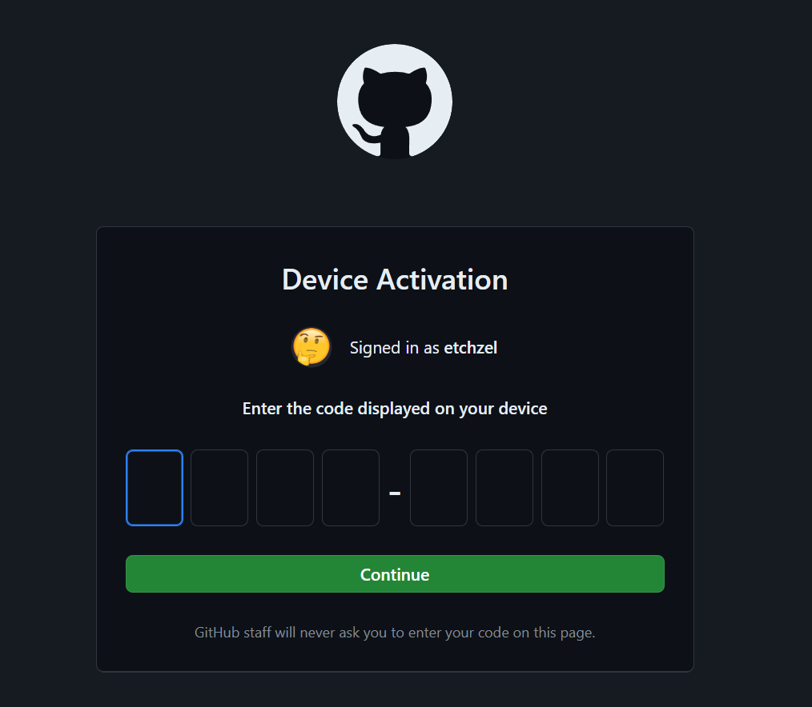

- Next clone the git repo:

  ```bash
  # clone repo
  git clone https://github.com/etchzel/dataproc-batch.git

  # change directory
  cd dataproc-batch
  ```

- Run the script `download_to_gcs.sh` to prepare the data

  ```bash
  # allow execution of script
  chmod +x download_to_gcs.sh

  # execute script to download data
  ./download_to_gcs.sh ~/dataproc-batch gs://trainer_gcs_001/dataproc/input
  ```

  If an auth pop up appears like below, click authorize:

  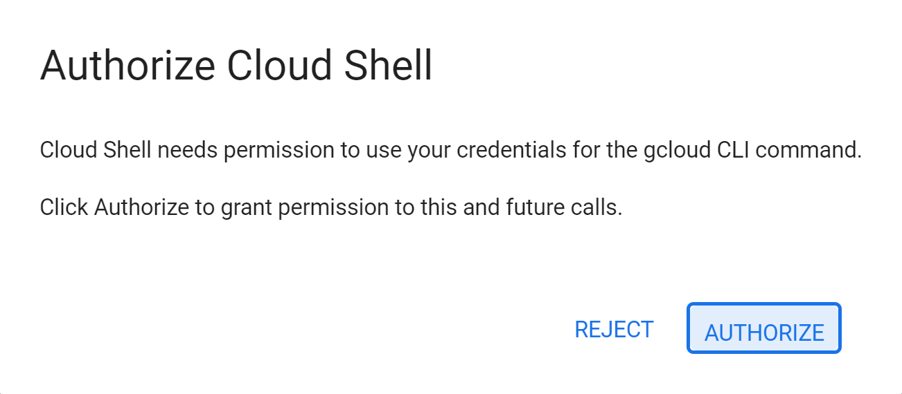

- Next copy the file `spark_job.py` to GCS

  ```bash
  gcloud storage cp spark_job.py gs://trainer_gcs_001/dataproc/spark_job.py
  ```

## Run Serverless Spark Job

- In the GCP Console, go to Dataproc page

  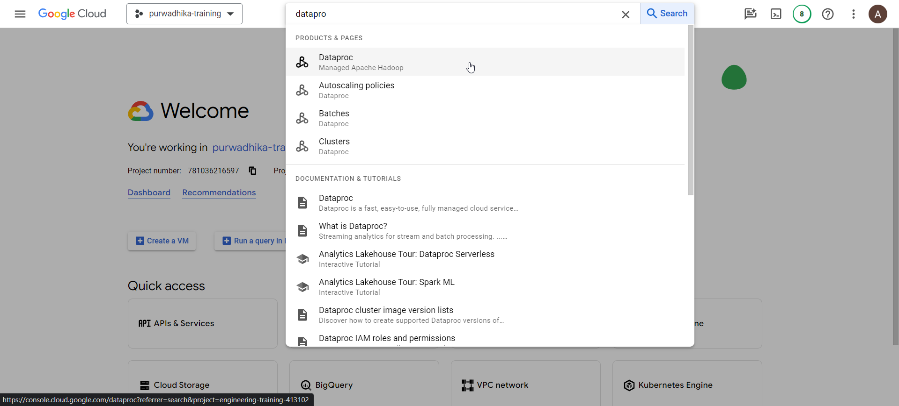

- Expand the sidebar and click on `Batches`

  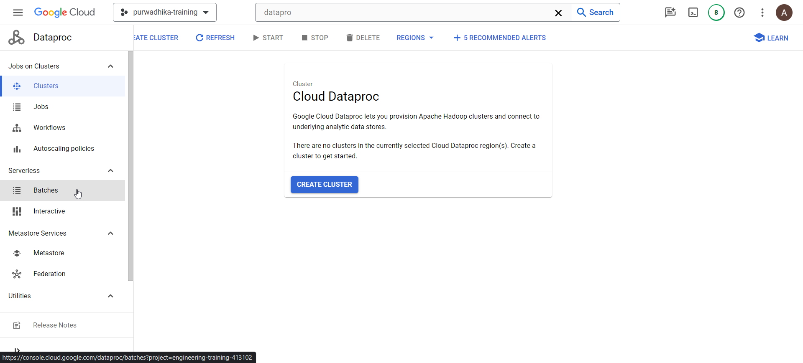

- Click on `CREATE`

  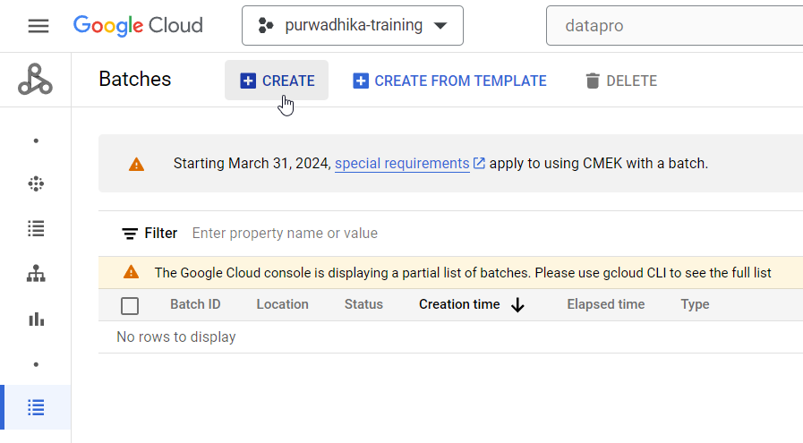

  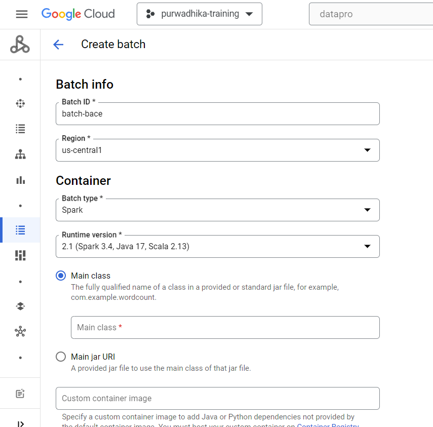

- Change region to `asia-southeast2` or whatever region you set up network private access with, and change `Batch type` under `Container` section to `PySpark`

  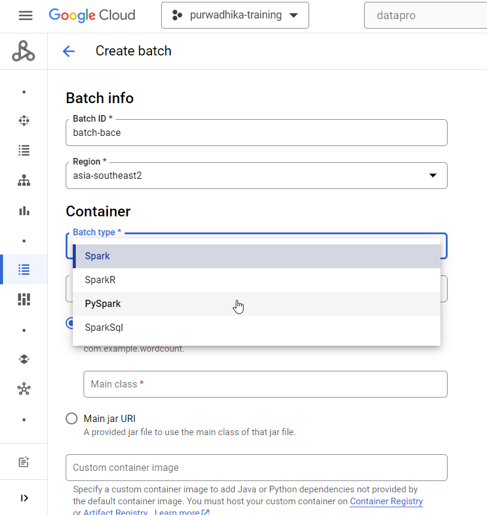

- Under `Main python file` enter the path to the main python file

  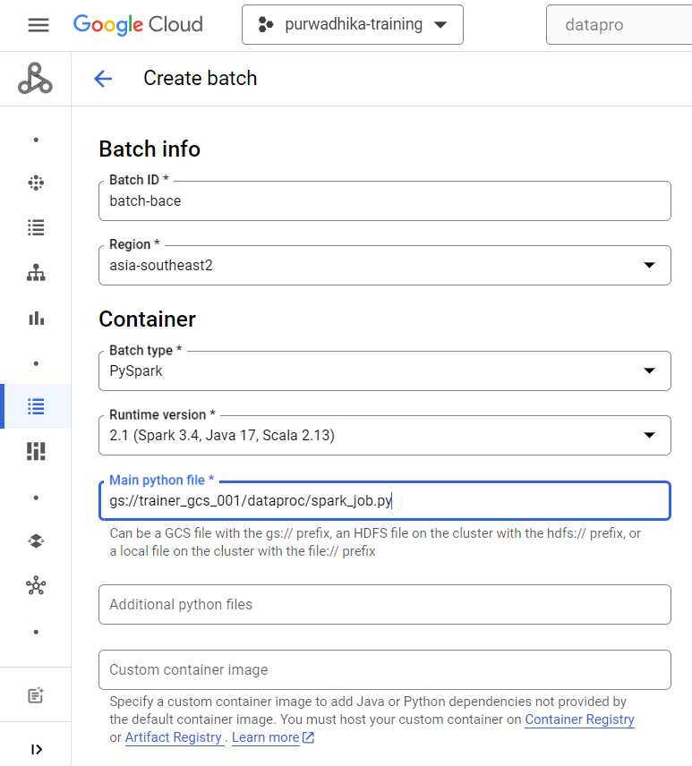
  
  (OPTIONAL) if you want to add python dependencies, you need to package all the python dependencies as zip file, or use custom container (for external dependencies as well)
  
  - Under `Additional python files` enter the path to the zipped python dependencies

    ```bash
    # prep folder
    mkdir utils

    # install dependencies on prep folder
    pip install <pypi-dependencies> <pypi-dependencies> --target=utils/

    # change directory to prep folder
    cd utils

    # zip the dependencies
    zip -r dependencies.zip .

    # copy the zipped file to cloud storage 
    gcloud storage cp dependencies.zip gs://trainer_gcs_001/dataproc/dependencies.zip
    ```

  - Under `Custom container images` enter the path to Artifact Registry of your container image

    ```bash
    asia-southeast2-docker.pkg.dev/engineering-training-413102/${AF_REPO_NAME}/${IMAGE_NAME}:${IMAGE_VERSION}
    ```

- Scroll below, under `Arguments` field, enter the following args line by line

  ```bash
  --input_green=gs://trainer_gcs_001/dataproc/input/green_tripdata_*.parquet
  --input_yellow=gs://trainer_gcs_001/dataproc/input/yellow_tripdata_*.parquet
  --output=${DATASET_NAME}.${TABLE_NAME}
  --temp_bucket=trainer_gcs_001/dataproc/temp
  --write_mode=overwrite
  ```

  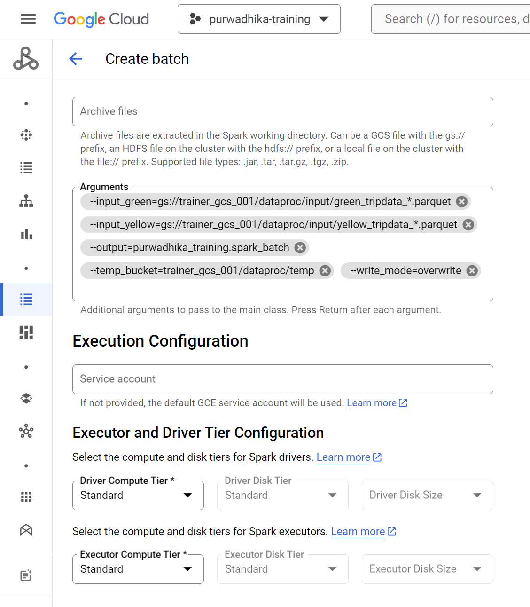

- Scroll below again, under `Network Configuration`, make sure network `default` and subnetwork `default` is selected (or change it if you have custom VPC & subnets configured for this)

  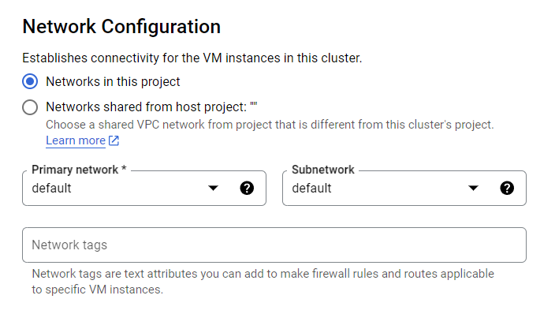

- Finally scroll below and click on `SUBMIT`
